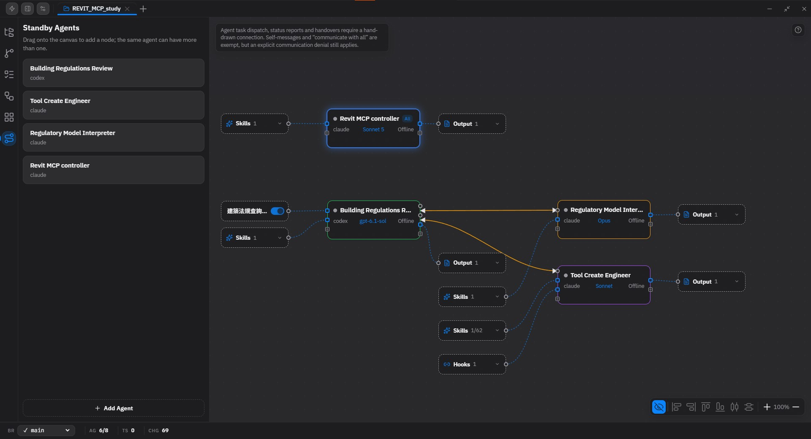

<div align="center">

# GT Office · CW-Agent-Office

### 面向 Claude Code 與 Codex CLI 的視覺化桌面工作台

在同一個工作區管理 Agent、連接協作者、掛載能力、查看交付成果，並操作終端、檔案與 Git。

[](LICENSE)

[下載](https://github.com/CWLin0518/CW-Agent-Office/releases) · [文件](docs/README.md) · [English](README.md)

</div>

本儲存庫是 **[GT Office](https://github.com/Laplace-bit/GT-Office) 的 CW-Agent-Office fork**，使用 Tauri、React 與 Rust，將終端型 AI Agent 整合到可保存設定、以工作區為範圍的桌面環境。現有原始碼版本：**0.7.6**。

## Agent Canvas 協作畫布



- 從待命 Agent 清單拖曳到畫布；同一個 Agent 可以有多個視覺實例。
- 手動畫出協作連線，定義哪些 Agent 能互相派發任務、回報進度及交接工作。
- 查看掛載的 **MCP 伺服器、Skills 與 Hooks**，切換 MCP 開關並查看啟用的 Skill 數量。
- 展開 **Output 輸出節點**，查看收集的交付檔案並開啟預覽。
- 使用框選、對齊、顏色、縮放及復原整理節點；重開工作區時還原保存的佈局。

連線代表通訊授權，不會自動執行整套工作流程。自己派發與「允許與所有 Agent 通訊」設定可豁免連線要求，但明確禁止通訊的設定仍優先生效。

## 現有功能

| 領域 | 已提供的能力 |
|---|---|
| 工作區 | 開啟專案目錄、切換工作區分頁，保存 Agent 設定與佈局。 |
| Agent 工位 | 在內嵌終端啟動 Claude Code 或 Codex CLI；設定提示詞、模型與啟動命令；安裝或更新支援的 CLI。 |
| Session 管理 | 查看歷史 Session、重新命名，並延續或分叉支援的 CLI Session。 |
| 能力掛載 | 為 Claude 與 Codex 設定各 Agent 的 MCP、Skills、Hooks。Claude 另支援排除全域 Skill／Hook 來源；Codex 沒有對應的全域來源開關。 |
| Agent 協作 | 使用內建 `gto` CLI 探索 Agent、派發任務、回覆進度、交接工作，以及查看收件匣與任務對話串。 |
| 任務與變更動態 | 查看任務進度、協作訊息與工作區變更。 |
| 檔案 | 瀏覽及搜尋檔案，使用 Monaco 編輯文字，預覽 Markdown、圖片、PDF、音訊與影片。 |
| Git | 查看狀態與差異、瀏覽提交圖、管理分支與 stash，以及操作提交歷史。 |
| 外部通道 | 設定 Telegram、微信與飛書轉接器，將 Agent 綁定到外部通道；需要完成服務憑證與連線設定。 |
| Business Designer | 以具型別的 Block 整理需求，查看推導關係與驗證缺口，審閱 Agent 提出的修改。 |
| 桌面設定 | 中英文介面、明暗主題、快捷鍵，以及工作區與視窗佈局控制。 |

活動狀態依近期終端輸出與 Session 生命週期事件呈現，無法可靠區分靜默思考與等待輸入。保存設定與 Session 歷史，也不代表已結束的程序會持續執行。

## 快速上手

### 安裝桌面版本

從[本 fork 的 Releases](https://github.com/CWLin0518/CW-Agent-Office/releases) 選擇可用安裝檔。建置流程涵蓋 **Windows、macOS 與 Linux**；實際產物依各次發布而定。各版本打包資訊請查看[發布紀錄](docs/releases/)。

Claude Code 與 Codex CLI 需要各自安裝及登入。可使用應用程式內的 provider 設定，或既有 CLI 安裝，再登入要使用的服務。

### 從原始碼啟動

前置條件：**Node.js 20+**、**Rust stable**、Git，以及 Tauri 2 的平台建置環境。Windows 需要 MSVC C++ 建置工具與 WebView2；macOS 需要 Xcode command-line tools；Linux 需要 WebKitGTK 及[發布工作流程](.github/workflows/release.yml)列出的桌面函式庫。

```bash
git clone https://github.com/CWLin0518/CW-Agent-Office.git
cd CW-Agent-Office
npm ci
npm run dev:tauri
```

`npm run dev:web` 只啟動前端；終端、檔案系統等原生能力需要桌面後端。

### 建立協作工作區

1. 開啟專案目錄作為工作區。
2. 新增 Claude 或 Codex Agent，設定提示詞與模型。
3. 掛載各 Agent 需要的 MCP 伺服器、Skills 與 Hooks。
4. 將 Agent 放到畫布，連接需要協作的對象。
5. 啟動終端、派發任務，查看回覆與 Output 輸出節點。

### 使用 `gto` 通訊

桌面應用程式與本機 bridge 運作時，在 Agent 終端執行：

```bash
gto directory snapshot --json
gto agent send-task --target-agent-id <agent-id> --title "Review changes" --markdown "Review the diff and report findings." --json
gto agent task-thread --task-id <returned-task-id> --json
```

Agent 終端會取得 `GTO_WORKSPACE_ID` 與 `GTO_AGENT_ID`。在其他環境執行時，請提供對應的工作區與 Agent 參數。保留回傳的 `taskId`，後續回報與交接使用相同 ID。若 PATH 找不到 `gto`，可在儲存庫根目錄使用 `node tools/gto/bin/gto.mjs`。完整命令與限制請見 [CLI 說明](tools/gto/README.md)。

## 功能範圍與已知限制

- 目前支援的編程 Agent provider 為 **Claude Code 與 Codex CLI**；Gemini CLI 支援已移除。
- 部分政策欄位目前僅保存設定，包括 Git／VCS 政策、執行逾時與最大步數，尚未在執行時強制套用。
- 延續 Session 時的協作上下文刷新，以及前端測試基礎設施，仍有工程追蹤項目。
- Provider Descriptor／版本鎖重構與進一步的權限控制仍屬規劃事項。

目前缺口與驗收紀錄請見[專案待辦與驗證依據](docs/TODO.md)。設計文件描述的目標可能超出現有實作範圍。

## 開發與驗證

```bash
npm run typecheck
cargo check --workspace
cargo fmt --all -- --check
cargo clippy --workspace --all-targets -- -D warnings
npm run build:tauri
```

```text
apps/desktop-web/       React 介面與 feature controllers
apps/desktop-tauri/     Tauri shell 與按 feature 分類的 commands
crates/                Rust 領域能力與基礎設施
packages/shared-types/ 共用契約
tools/gto/             Agent 通訊 CLI
docs/                  架構、工作流程、驗收與發布紀錄
```

## 文件與參與開發

- [文件索引](docs/README.md)
- [系統架構](docs/ARCHITECTURE.md) · [核心工作流程](docs/WORKFLOWS.md)
- [API 契約](docs/API_CONTRACTS.md) · [依賴政策](docs/DEPENDENCIES.md)
- [目前進度](docs/TODO.md) · [發布流程](docs/release-process.md)
- [貢獻指南](CONTRIBUTING.md) · [儲存庫規則](AGENTS.md)

依[議題追蹤政策](docs/agents/issue-tracker.md)，上游議題使用 [Laplace-bit/GT-Office Issues](https://github.com/Laplace-bit/GT-Office/issues)。回報問題時請區分上游行為與本 fork 的專屬變更。

採用 [Apache 2.0 授權](LICENSE)。
